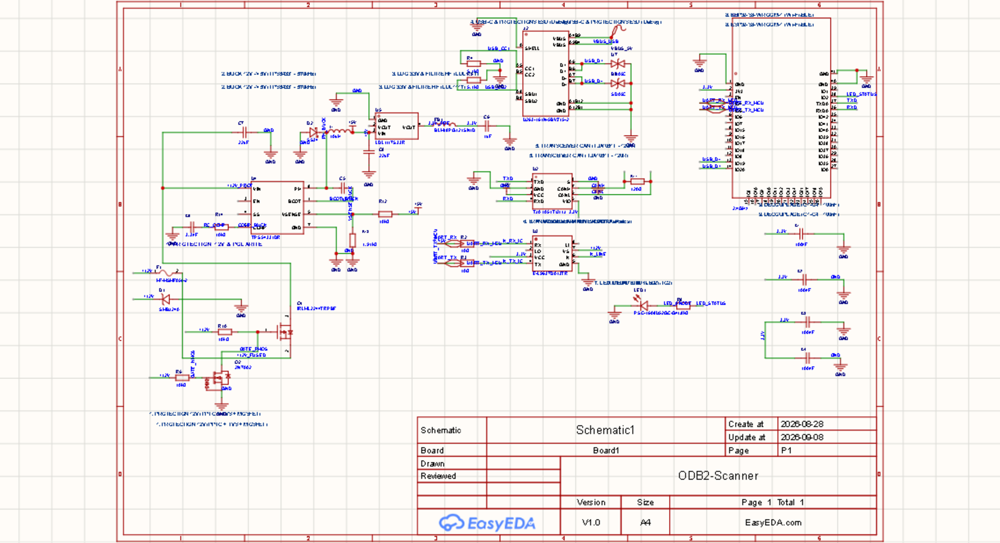
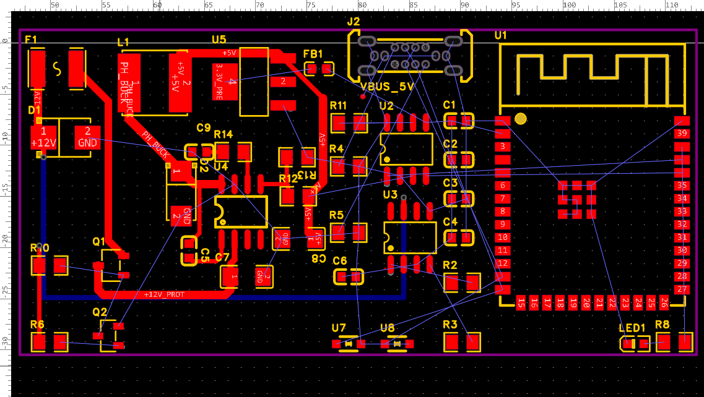

# Scanner OBD-II ESP32 (Daewoo Kalos)

Projet de conception matérielle (schématique et PCB) d'un scanner de diagnostic automobile OBD-II intelligent et communicant, optimisé pour une **Daewoo Kalos (2003, moteur 1.4L)**.

---

## 1. Objectifs du Projet

* **Diagnostic embarqué :** Lecture des données moteur en temps réel et des codes défauts (DTC) via la prise standard OBD-II (16 broches).
* **Connectivité sans fil :** Module **ESP32** assurant la liaison sans fil (Wi-Fi / Bluetooth) vers une application smartphone Android dédiée.
* **Support multi-protocoles :**
  * **Ligne K-Line (ISO 9141-2 / ISO 14230 KWP2000) :** Protocole principal du calculateur moteur (ECU) de la Daewoo Kalos.
  * **Bus CAN (ISO 15765-4) :** Diagnostic haute vitesse et compatibilité véhicules modernes.
* **Alimentation robuste & sécurisée :**
  * Alimentation directe depuis le 12V batterie de la prise diagnostic.
  * Protection contre les surtensions, inversions de polarité et surintensités (fusible réarmable PPTC `F1`, diode TVS `D1`, MOSFETs de protection `Q1`/`Q2`).
  * Double étage de conversion : abaisseur à découpage performant 12V → 5V (`U4` / `L1`) suivi d'un régulateur linéaire ultra-propre 3.3V (`U5` / `FB1`) pour l'ESP32 et la logique.

---

## 2. Architecture Matérielle & Composants Clés

### 2.1 Composants Clés du Système

| Fonction | Réf. Composant | Boîtier | Description |
| :--- | :--- | :--- | :--- |
| **Microcontrôleur & RF** | `U1` (ESP32-S3-WROOM-1-N16R8) | SMD Module | MCU Wi-Fi/BLE double cœur Xtensa LX7 (16MB Flash, 8MB PSRAM), antenne PCB intégrée. |
| **Transceiver K-Line** | `U3` (L9637D013TR) | SOIC-8 | Émetteur-récepteur ISO 9141/KWP2000 avec protection thermique et court-circuit. |
| **Transceiver CAN** | `U2` (TJA1051T/3/1J) | SOIC-8 | Transceiver CAN haute vitesse alimenté en 5V (`VCC`) avec broche d'adaptation logique `VIO` (3.3V). |
| **Régulateur Buck (12V → 5V)** | `U4` (TPS54331DR) | SOIC-8 | Convertisseur step-down non-synchrone 3.5V-28V, 3A (diode de roue libre externe `D2`). |
| **Régulateur LDO (5V → 3.3V)** | `U5` (LDL1117S33R) | SOT-223-4 | LDO 3.3V 1.2A à faible chute de tension et fort réjection de bruit (PSRR). |
| **Amortissement UART** | `R2`, `R3` (10 Ω) | 0805 | Résistances série d'amortissement sur les lignes `UART_RX` et `UART_TX` vers l'ESP32. |
| **Terminaison CAN** | `R11` (120 Ω) | 0805 | Résistance de terminaison de ligne du bus différentiel CAN. |
| **Protection ESD USB** | `U7`, `U8` (SD05C) | SOD-323 | Diodes de protection ESD bidirectionnelles sur les lignes USB D+/D-. |
| **Protection Surtension 12V** | `D1` (SMBJ24A) | SMB | Diode TVS 24V d'écrêtage des transitoires automobiles. |
| **Roue libre Buck** | `D2` (SS34) | SMA | Diode Schottky 40V 3A de roue libre (cathode sur `PH`, anode sur `GND`). |
| **Feedback Buck 5V** | `R12` (10 kΩ), `R13` (1.91 kΩ) | 0805 | Pont diviseur de contre-réaction fixant la régulation de sortie de `U4` à 5.0V (broche `VSENSE`). |
| **Compensation Buck** | `R14` (10 kΩ), `C9` (3.3 nF) | 0805 / 0603 | Réseau série de compensation de boucle pour la stabilité de `U4` (broche `COMP`). |
| **Connecteur USB-C** | `J2` (U263-161N-5BVZ15-2) | 16-pin SMD | Port USB-C pour alimentation de test, programmation et débogage. |

---

### 2.2 Nomenclature Complète du Schéma & PCB (37 composants)

Inventaire extrait directement du projet actif via l'API EasyEDA Pro :

| Désignateur | Valeur (`Value`) | Référence Fabricant (`Device`) | Empreinte (`Footprint`) | Description / Fonction |
| :--- | :--- | :--- | :--- | :--- |
| **C1** | 100nF | CL10B104KB8NNNC | `C0603` | Découplage alimentation ESP32 (rail 3.3V) |
| **C2** | 100nF | CL10B104KB8NNNC | `C0603` | Découplage alimentation ESP32 (rail 3.3V) |
| **C3** | 100nF | CL10B104KB8NNNC | `C0603` | Découplage alimentation transceiver CAN `U2` |
| **C4** | 100nF | CL10B104KB8NNNC | `C0603` | Découplage alimentation transceiver K-Line `U3` |
| **C5** | 1uF | CL10A105KA8NNNC | `C0603` | Bootstrap convertisseur Buck `U4` (broches BOOT → PH) |
| **C6** | 1uF | CL10A105KA8NNNC | `C0603` | Filtrage sortie régulateur LDO `U5` (rail 3.3V) |
| **C7** | 22uF | TCC1206X5R226K250HT | `C1206` | Condensateur réservoir entrée Buck `U4` (rail 12V VIN) |
| **C8** | 22uF | TCC1206X5R226K250HT | `C1206` | Condensateur filtrage sortie Buck `U4` (dérivation rail 5V vers GND) |
| **C9** | 3.3nF | CL10B332KB8NNNC | `C0603` | Condensateur de compensation de boucle Buck `U4` (broche COMP vers GND) |
| **D1** | *—* | SMBJ24A_C19077578 | `SMB_L4.3-W3.6-LS5.3-RD` | Diode TVS 24V de protection contre les surtensions OBD-II |
| **D2** | *—* | SS34_C52023881 | `SMA_L4.3-W2.6-LS5.1-RD` | Diode Schottky 40V 3A de roue libre (Cathode sur PH, Anode sur GND) pour convertisseur Buck `U4` |
| **F1** | *—* | MF-MSMF050-2 | `F1812` | Fusible réarmable PPTC 0.5A protection ligne 12V |
| **FB1** | *—* | BLM18PG121SN1D_C14709 | `L0603` | Perle de ferrite pour filtrage HF du rail 3.3V LDO |
| **J2** | *—* | U263-161N-5BVZ15-2 | `USB-TH-TYPE-C_U263-161N-5BVZ14-2` | Connecteur USB Type-C 16 broches (flash, debug et test 5V) |
| **L1** | 10uH | YNR6045-100M | `IND-SMD_L6.0-W6.0` | Inductance blindée 10µH étage Buck `U4` |
| **LED1** | *—* | PSC-1608U52GC-G4 | `LED0603-RD_GREEN` | LED d'état verte pilotée par la broche IO2 de l'ESP32 |
| **Q1** | *—* | IRLML2244TRPBF | `SOT-23-3_L2.9-W1.6-P1.90-LS2.8-BR` | P-MOSFET protection contre l'inversion de polarité 12V |
| **Q2** | *—* | 2N7002_C50176485 | `SOT-23-3_L2.9-W1.3-P1.90-LS2.4-BR` | N-MOSFET commande et commutation alimentation |
| **R2** | 10Ω | FRC0805F10R0TS | `R0805` | Résistance série amortissement ligne K-Line RX |
| **R3** | 10Ω | FRC0805F10R0TS | `R0805` | Résistance série amortissement ligne K-Line TX |
| **R4** | 5.1kΩ | 0805W8F5101T5E | `R0805` | Résistance pull-down USB-C configuration CC1 |
| **R5** | 5.1kΩ | 0805W8F5101T5E | `R0805` | Résistance pull-down USB-C configuration CC2 |
| **R6** | 10kΩ | 0805W8F1002T5E | `R0805` | Résistance de polarisation / pull-up |
| **R8** | 1.8kΩ | FRC0805J182 TS | `R0805` | Résistance de limitation de courant LED1 |
| **R10** | 10kΩ | 0805W8F1002T5E | `R0805` | Résistance de polarisation / pull-up |
| **R11** | 120Ω | 0805W8F1200T5E | `R0805` | Résistance de terminaison de ligne différentielle CAN |
| **R12** | 10kΩ | 0805W8F1002T5E | `R0805` | Résistance haute pont diviseur feedback Buck `U4` (rail 5V vers VSENSE) |
| **R13** | 1.91kΩ | 0805W8F1911T5E | `R0805` | Résistance basse pont diviseur feedback Buck `U4` (VSENSE vers GND) |
| **R14** | 10kΩ | 0805W8F1002T5E | `R0805` | Résistance série compensation de boucle Buck `U4` (broche COMP) |
| **U1** | 2.4GHz | ESP32-S3-WROOM-1-N16R8 | `WIRELM-SMD_ESP32-S3-WROOM-1` | SoC ESP32-S3 Wi-Fi 2.4 GHz + BLE 5.0 (16MB Flash / 8MB PSRAM) |
| **U2** | *—* | TJA1051T/3/1J | `SOIC-8_L4.9-W3.9-P1.27-LS6.0-BL` | Transceiver CAN haute vitesse avec broche VIO (3.3V) |
| **U3** | *—* | E-L9637D013TR | `SOIC-8_L4.9-W3.9-P1.27-LS6.0-BL` | Transceiver K-Line ISO 9141 / KWP2000 |
| **U4** | *—* | TPS54331DR | `SOIC-8_L5.0-W4.0-P1.27-LS6.0-BL` | Régulateur abaisseur Step-Down Buck 12V → 5V, 3A |
| **U5** | *—* | LDL1117S33R | `SOT-223-4_L6.5-W3.5-P2.30-LS7.0-BR` | Régulateur linéaire LDO 5V → 3.3V faible bruit, 1.2A |
| **U7** | *—* | SD05C_C53238084 | `SOD-323_L1.7-W1.3-LS2.5-BI` | Diode ESD bidirectionnelle protection ligne USB D+ |
| **U8** | *—* | SD05C_C53238084 | `SOD-323_L1.7-W1.3-LS2.5-BI` | Diode ESD bidirectionnelle protection ligne USB D- |
| **VBUS_5V**| *—* | Test-Point | `Test-Point-0.5mm` | Point de test pad cuivre pour le rail 5V USB |

---

## 3. État Actuel de l'Implémentation

* **Schématique :** Schéma complet validé sous EasyEDA Pro (feuille `P1`), mis à jour et corrigé le 03/09/2026 :
  * *Étage Buck TPS54331 (`U4`) :* Recâblage conforme de la diode Schottky de roue libre `D2` (`SS34` : cathode sur `PH`, anode sur `GND`), condensateur de sortie `C8` (22 µF) en dérivation vers la masse, ajout du pont diviseur de feedback `R12` (10 kΩ) / `R13` (1.91 kΩ) fixant la régulation à 5.0V sur `VSENSE`, et du réseau série de compensation `R14` (10 kΩ) / `C9` (3.3 nF) sur `COMP`.
  * *Rail +5V :* Alimentation de l'étage LDO `U5` et de la broche 3 (`VCC`) du transceiver CAN `U2`.
  * *Visibilité & Raccordement :* Toutes les étiquettes (`R12`, `R13`, `R14`, `C9` et leurs valeurs) et les continuités physiques vers les broches et drapeaux `GND` sont vérifiées.
* **Placement des composants (PCB) :** Placement 2D compact initialement validé sur 33 composants :
  * *Bloc Puissance (à gauche) :* Protections 12V, convertisseur buck `TPS54331` et régulateur `LDL1117`.
  * *Bloc Interfaces (au centre) :* Puces CAN `U2` et K-Line `U3`.
  * *Bloc Logique & Antenne (à droite) :* Module ESP32 avec son antenne orientée vers le bord extérieur libre.
  * *Composants à synchroniser :* Les 4 nouveaux composants (`R12`, `R13`, `R14`, `C9`) doivent être importés et placés sur le PCB.
* **Contour de carte (Board Outline) :** Défini et tracé sur la couche dédiée.

### Schéma



### PCB



---

### 3.1 Prochaine Étape Immédiate

> [!IMPORTANT]
> **Prochaine action à exécuter : Synchronisation Schéma → PCB & Routage de l'étage Buck**
>
> 1. **Importer les modifications dans le PCB (`Design > Update PCB`) :**
>    * Injecter les 4 nouveaux composants (`R12`, `R13`, `R14`, `C9`) dans le layout `PCB1`.
>    * Actualiser le chevelu (ratsnest) : nouvelle boucle de roue libre pour `D2` (`PH` → `GND`), filtrage shunt pour `C8` (`+5V` → `GND`), et alimentation `+5V` sur la broche 3 (`VCC`) de `U2`.
> 2. **Placement 2D des composants de l'étage Buck sur le PCB :**
>    * Rapprocher `D2` (`SS34`) au plus près immédiat de la broche 8 (`PH`) de `U4` et de l'entrée de `L1` pour minimiser la surface de la boucle de commutation critique (source majeure d'EMI).
>    * Placer `C8` en sortie directe de `L1`.
>    * Placer le pont diviseur `R12` / `R13` au plus près de la broche 5 (`VSENSE`).
>    * Placer le réseau série `R14` / `C9` au plus près de la broche 6 (`COMP`).
> 3. **Routage de l'étage Buck :**
>    * Procéder au tracé des pistes de puissance de l'étage Buck selon la checklist ci-dessous (§ 4.1).

---

## 4. Feuille de Route & Checklist (TODO)

### 4.1 Étage Buck & Routage des Pistes d'Alimentation
- [x] **Rail +12V et Protection :** *(Routage réalisé via l'API EasyEDA Pro)*
  - [x] Piste large (0.8 mm à 1.0 mm) reliant la broche 16 OBD → Fusible `F1` → Diode TVS `D1` → MOSFETs `Q1`/`Q2`. *(Pistes de puissance de 35 mil / ~0.89 mm tracées sur Top Layer, reliant l'entrée F1(1) à D1(1), F1(2) vers Q1(2) et polarisation R10/R6)*
  - [x] Piste 12V vers la broche 7 (`VS`) de `U3` (0.5 mm). *(Piste 20 mil / ~0.50 mm routée via Bottom Layer et 2 vias de 24/12 mil pour franchir l'étage de découpage central)*
- [ ] **Synchronisation & Placement Buck :**
  - [ ] Exécuter « Update PCB from Schematic » pour importer `R12`, `R13`, `R14`, `C9` et les nouveaux chevelus nets sur le PCB.
  - [ ] Placer `D2`, `C8`, `R12`, `R13`, `R14`, `C9` sur le PCB selon les règles de minimisation des boucles d'induction et de bruit.
- [ ] **Routage Étage Buck 12V → 5V (`TPS54331DR` / `U4`) :**
  - [ ] Boucle de commutation courte et large : `U4` (broche 8 PH), inductance `L1` (10 µH) et diode Schottky `D2` (`SS34` : cathode sur PH, anode sur GND).
  - [ ] Condensateur d'entrée `C7` (22 µF) au plus près de la broche 2 (`VIN`) de `U4`.
  - [ ] Condensateur de sortie `C8` (22 µF) en dérivation juste après `L1` (vers le plan GND).
  - [ ] Condensateur de bootstrap `C5` (1 µF) entre broche 1 (`BOOT`) et broche 8 (`PH`).
  - [ ] Pont diviseur de feedback : `R12` (10 kΩ) et `R13` (1.91 kΩ) au plus près de la broche 5 (`VSENSE`).
  - [ ] Réseau de compensation : `R14` (10 kΩ) et `C9` (3.3 nF) au plus près de la broche 6 (`COMP`).
- [ ] **Étage Régulation 3.3V (`LDL1117S33R` / `U5`) :**
  - [ ] Entrée `VIN` reliée au 5V (`L1` / `C8`).
  - [ ] Sortie `VOUT` vers perle de ferrite `FB1` et condensateur de filtrage `C6` (1 µF).
  - [ ] Distribution du rail 3.3V vers le réseau de découplage `C1` à `C4` (100 nF) puis broche 2 de l'ESP32 `U1`.
  - [ ] Distribution 3.3V vers broche 5 (`VIO`) de `U2` et broche 3 (`VCC`) de `U3`.
- [ ] **Alimentation 5V :**
  - [ ] Distribution du rail 5V vers broche 3 (`VIN`) de `U5`, broche 3 (`VCC`) du transceiver CAN `U2` et résistance de contre-réaction `R12`.

### 4.2 Routage des Signaux de Communication
- [ ] **Ligne K-Line (`U3` - `L9637D013TR`) :**
  - [ ] `UART_RX` : Broche 1 (`RX`) de `U3` → `R2` (10 Ω) → Broche 4 (`IO4`) de l'ESP32.
  - [ ] `UART_TX` : Broche 4 (`TX`) de `U3` → `R3` (10 Ω) → Broche 5 (`IO5`) de l'ESP32.
  - [ ] Ligne physique `K` : Broche 6 (`K`) de `U3` → Broche 7 de la prise OBD-II (0.4 mm à 0.5 mm).
- [ ] **Bus CAN (`U2` - `TJA1051T/3/1J`) :**
  - [ ] Lignes logiques : `TXD` (broche 1) → Broche 37 (`TXD0`) ESP32 ; `RXD` (broche 4) → Broche 36 (`RXD0`) ESP32.
  - [ ] Mode normal : Broche 8 (`S`) → Masse `GND`.
  - [ ] Paire différentielle CAN : `CANH` (broche 7) et `CANL` (broche 6) → Terminaison `R11` (120 Ω) → Broches 6 et 14 OBD-II *(pistes parallèles, symétriques et de même longueur)*.
- [ ] **Port USB-C & Programmation (`J2`) :**
  - [ ] Signaux `USB_D-` et `USB_D+` depuis `J2` via protections ESD `U8` / `U7` vers broches 13 (`IO19`) et 14 (`IO20`) de l'ESP32.
  - [ ] Résistances de configuration CC : Broches `CC1` et `CC2` de `J2` vers `R4` et `R5` (5.1 kΩ) → `GND`.
- [ ] **LED d'État (`LED1`) :**
  - [ ] Broche 38 (`IO2`) ESP32 → `R8` (1.8 kΩ) → Anode `LED1` → Cathode `GND`.

### 4.3 Plan de Masse & Gestion RF
- [ ] **Zone d'exclusion d'antenne (Keep-out Zone) :**
  - [ ] Définir une zone `Copper Keepout` sur **toutes les couches (All Layers)** sous et autour de l'antenne méandre de l'ESP32 (coin supérieur droit).
  - [ ] Garantir l'absence totale de cuivre (aucun plan de masse ni piste) pour préserver les performances radio.
- [ ] **Plans de masse (Copper Area) :**
  - [ ] Plan `GND` sur **Top Layer** (remplissage Solid, dégagement 0.254 mm - 0.3 mm, Thermal Relief).
  - [ ] Plan `GND` sur **Bottom Layer** (remplissage Solid, dégagement 0.254 mm - 0.3 mm, Thermal Relief).
- [ ] **Vias de couture (Stitching Vias) :**
  - [ ] Vias de masse sous le pad thermique central de l'ESP32 (broches 41).
  - [ ] Vias de masse au niveau des condensateurs de découplage et du bloc de découpage `U4`/`D2`.
  - [ ] Vias de masse réguliers le long du contour de carte.

### 4.4 Contrôles Finaux & Fabrication
- [ ] **Contrôle DRC (Design Rule Check) :** Exécuter la vérification des règles de conception sous EasyEDA Pro (`Shift + R`) et corriger les erreurs éventuelles.
- [ ] **Visualisation 3D :** Vérification visuelle globale de l'assemblage et du dégagement mécanique.
- [ ] **Export des fichiers de production :**
  - [ ] Fichiers Gerber & Perçage (Drill).
  - [ ] Fichier de nomenclature (BOM).
  - [ ] Fichier de placement des composants (CPL / Pick & Place).

---

## 5. Fichiers du Dépôt

* `ODB2-Scanner.eprj2` : Projet natif EasyEDA Pro v2 (contenant le schéma `P1` et le circuit imprimé `PCB1`).
* `README.md` : Documentation technique complète et suivi du projet.

---

## 6. Automatisation IA via EasyEDA Pro

Pour permettre à un assistant IA (Claude Code, Codex, Antigravity, OpenCode...) de manipuler directement le schéma et le PCB en temps réel (routage autonome des pistes, placement, création des zones de cuivre, etc.), ce projet s'appuie sur le **skill officiel EasyEDA** : [easyeda/easyeda-api-skill](https://github.com/easyeda/easyeda-api-skill), maintenu par l'éditeur lui-même.

### 6.1 Architecture

Le principe repose sur un **pont local** qui fait le lien entre l'IA et l'API interne d'EasyEDA, laquelle n'existe que dans le contexte JavaScript de l'onglet navigateur :

```
IA (Claude Code / Copilot CLI / Antigravity / Codex)
        │  Agent Skill (SKILL.md) + API HTTP/WebSocket
        ▼
Serveur Node.js (pont local)  ─────  tourne sur le PC, port auto 49620-49629
        │  WebSocket (localhost)
        ▼
Extension .eext (run-api-gateway) ──  JavaScript, injectée dans l'onglet
        │  appel direct                     navigateur EasyEDA Pro
        ▼
API interne EasyEDA (eda.pcb_..., eda.sch_..., eda.dmt_...)
```

Deux briques distinctes, deux cycles de vie :
- Le **serveur Node.js** est relancé à chaque session (par le client IA ou manuellement).
- L'**extension `.eext`** est importée **une seule fois** dans EasyEDA Pro (Extensions → Extension Manager → Import Extension) et reste active tant qu'elle n'est pas désinstallée.

### 6.2 Installation

```bash
git clone https://github.com/easyeda/easyeda-api-skill
cd easyeda-api-skill
npm install
npm run build:docs   # génère la documentation API structurée dans docs/
npm run server       # démarre le pont WebSocket/HTTP (port auto 49620-49629)
```

### 6.3 Installation de l'extension EasyEDA

1. Télécharger `run-api-gateway.eext` depuis <https://jlc-ext.com/item/oshwhub/run-api-gateway>.
2. Dans EasyEDA Pro : **Settings → Extensions → Extension Manager → Import Extension**.
3. Sélectionner le fichier téléchargé et vérifier que **"Allow External Interaction"** reste activé.
4. Ouvrir `ODB2-Scanner.eprj2` : l'extension se connecte automatiquement au serveur en scannant la plage de ports et en validant le handshake (`service: "easyeda-bridge"`).

### 6.4 Connexion depuis le client IA & Démarrage automatique

Aucune configuration `mcp_config.json` n'est nécessaire. Les outils compatibles **Agent Skills** (Claude Code, OpenCode, QwenCode, Antigravity...) lisent automatiquement `SKILL.md` à la racine du dépôt cloné et disposent alors des instructions et de la documentation API.

#### Automatisation sous Antigravity (Lifecycle Hook)
Pour éviter de devoir lancer manuellement `npm run server` ou de valider des invites de permissions de commande shell à chaque session :
* **Hook de cycle de vie** : Le projet inclut un hook configuré dans [`.agents/hooks.json`](.agents/hooks.json) appelant le script [`.agents/ensure-bridge.mjs`](.agents/ensure-bridge.mjs).
* **Déclenchement automatique** : Dès qu'une interaction commence dans `agy` (`PreInvocation`), le script teste si le port `49620` (ou plage `49620-49629`) répond. Si le pont est inactif, il est démarré automatiquement en arrière-plan détaché (logs consignés dans `.agents/easyeda-bridge.log`).
* **Comportement lors d'un arrêt forcé (`kill`)** : Si les processus `node` sont arrêtés manuellement, le serveur reste coupé pendant l'inactivité. Dès que vous envoyez une nouvelle commande ou invite à l'IA, le hook détecte l'absence du serveur et le relance automatiquement avant de traiter la requête.
* **Désactivation du démarrage automatique** : Pour désactiver ce comportement et empêcher le démarrage en arrière-plan, il suffit de passer `"enabled": false` dans [`.agents/hooks.json`](.agents/hooks.json).

Pour un appel manuel ou un test (le port exact est affiché au démarrage du serveur, ex. `49620`) :

```bash
# Vérifier la connexion à EasyEDA
curl http://localhost:49620/health

# Exécuter du code EasyEDA à distance
curl -X POST http://localhost:49620/execute \
  -H "Content-Type: application/json" \
  -d '{"code": "return await eda.dmt_Project.getCurrentProjectInfo();"}'
```

### 6.5 Modules API pertinents pour ce projet

| Préfixe | Domaine | Classes clés utiles au routage de l'`ODB2-Scanner` |
|---|---|---|
| `PCB_` | PCB & Footprint | `PrimitiveLine` (pistes), `PrimitiveVia` (vias), `PrimitivePour` (plans de masse), `PrimitivePad`, `Drc` (vérification des règles), `Net`, `Layer` |
| `DMT_` | Gestion de document | `Project`, `Pcb`, `Board`, `EditorControl` |
| `SCH_` | Schématique | `PrimitiveComponent`, `PrimitiveWire` |
| `EPCB_` / `ESCH_` | Énumérations | `LayerId`, `PrimitiveType`, `PadType` |

Exemple de tracé de piste, tiré de la documentation du skill (unités en mil) :

```javascript
// Créer une piste cuivre sur la couche Top pour le net GND
await eda.pcb_PrimitiveLine.create(
  "GND",              // nom du net
  EPCB_LayerId.TOP,   // couche (énum, pas un nombre brut)
  0, 0,               // startX, startY
  100, 0              // endX, endY
);
```

Pour déplacer un élément existant (via, composant), le pattern asynchrone recommandé par le skill est :

```javascript
const prim = await eda.pcb_PrimitiveVia.get([viaId]);
const asyncPrim = prim.toAsync();
asyncPrim.setState_X(newX);
asyncPrim.setState_Y(newY);
asyncPrim.done();
```

### 6.6 Guide Pratique & Scripts Réutilisables avec le Skill EasyEDA

#### 6.6.1 Extraction de la nomenclature (BOM) et des empreintes depuis le PCB

Pour inspecter l'ensemble des composants placés sur le PCB, lire leurs valeurs, références LCSC et empreintes associées :

```javascript
const ids = await eda.pcb_PrimitiveComponent.getAllPrimitiveId();
const components = await eda.pcb_PrimitiveComponent.get(ids);

const results = [];
for (const c of components) {
  const fpInfo = c.getState_Footprint?.() || c.footprint;
  let fpName = '';
  if (fpInfo?.uuid && fpInfo?.libraryUuid) {
    const fp = await eda.lib_Footprint.get(fpInfo.uuid, fpInfo.libraryUuid);
    fpName = fp?.name || fp || '';
  }

  const props = c.getState_OtherProperty?.() || {};
  results.push({
    designator: c.getState_Designator?.() || c.designator,
    value: props.Value || props.Device || '',
    footprint: fpName
  });
}
return results;
```

#### 6.6.2 Extraction de la géométrie des pastilles (Pads) par filet (`Net`)

Avant de router une piste, il est indispensable d'interroger la position réelle des pastilles.
* **Unités :** Les coordonnées renvoyées par l'API PCB sont exprimées en **mils** (1 mil = 0.0254 mm).
* **Attributs clés :** `center.x`, `center.y`, `num` (numéro de broche), `parentId` (identifiant du composant parent), `topWidth`, `topHeight` (dimensions en dixièmes de mil).

```javascript
const targetNets = ['+12V', '+12V_PROT'];
const compIds = await eda.pcb_PrimitiveComponent.getAllPrimitiveId();
const comps = await eda.pcb_PrimitiveComponent.get(compIds);
const compMap = new Map();
for (const c of comps) {
  compMap.set(c.getState_PrimitiveId(), c.getState_Designator());
}

const padGeometry = [];
for (const net of targetNets) {
  const prims = await eda.pcb_Net.getAllPrimitivesByNet(net);
  for (const p of prims) {
    padGeometry.push({
      designator: compMap.get(p.parentId) || p.parentId,
      padNumber: p.num,
      net: p.net,
      x: Math.round(p.center.x * 10) / 10,
      y: Math.round(p.center.y * 10) / 10,
      width_mil: Math.round((p.topWidth || 0) * 10 * 10) / 10,
      height_mil: Math.round((p.topHeight || 0) * 10 * 10) / 10,
      shape: p.topType
    });
  }
}
return padGeometry;
```

#### 6.6.3 Routage programmatique de pistes et vias

* **Couches au runtime :** Les identifiants de couches sont numériques dans l'environnement navigateur EasyEDA Pro :
  * `1` = `Top Layer` (couche supérieure)
  * `2` = `Bottom Layer` (couche inférieure)
  * `11` = `Board Outline` (contour de carte)
* **API de tracé de ligne :** `eda.pcb_PrimitiveLine.create(net, layer, startX, startY, endX, endY, lineWidth, primitiveLock)`
* **API de création de via :** `eda.pcb_PrimitiveVia.create(net, x, y, holeDiameter, diameter)` (dimensions standard JLCPCB : perçage 12 mil ≈ 0.3 mm, diamètre 24 mil ≈ 0.6 mm).

Exemple concret exécuté pour le routage du **Rail +12V et Protection (TODO 4.1)** :

```javascript
const LAYER_TOP = 1;
const LAYER_BOTTOM = 2;

const W_POWER_12V = 35;   // ~0.89 mm (largeur de puissance 0.8 - 1.0 mm)
const W_KLINE_12V = 20;   // ~0.50 mm (alimentation U3)
const W_SIGNAL = 16;      // ~0.40 mm (polarisation)

// 1. Tracé F1(1) -> D1(1) sur Top Layer (Net: +12V)
await eda.pcb_PrimitiveLine.create('+12V', LAYER_TOP, 1919.6, -100.0, 1919.6, -343.0, W_POWER_12V, false);
await eda.pcb_PrimitiveLine.create('+12V', LAYER_TOP, 1919.6, -343.0, 1941.1, -364.5, W_POWER_12V, false);

// 2. Tracé F1(2) -> Q1(2) sur Top Layer (Net: +12V_PROT)
// Piste de 28 mil (~0.71 mm) centrée à x = 2190 pour respecter les jeux avec D1 pad 2 et L1 pad 1
const W_PROT = 28;
await eda.pcb_PrimitiveLine.create('+12V_PROT', LAYER_TOP, 2065.6, -100.0, 2190.0, -224.4, W_PROT, false);
await eda.pcb_PrimitiveLine.create('+12V_PROT', LAYER_TOP, 2190.0, -224.4, 2190.0, -760.5, W_PROT, false);
await eda.pcb_PrimitiveLine.create('+12V_PROT', LAYER_TOP, 2190.0, -760.5, 2248.6, -819.1, W_PROT, false);

// 3. Polarisation R10(1) -> R6(1) sur Top Layer (Net: +12V)
await eda.pcb_PrimitiveLine.create('+12V', LAYER_TOP, 1924.9, -856.5, 1924.9, -1151.3, W_SIGNAL, false);

// 4. Alimentation U3 broche 7 (+12V, 0.5 mm) via Bottom Layer
await eda.pcb_PrimitiveVia.create('+12V', 1941.1, -440.0, 12, 24);
await eda.pcb_PrimitiveLine.create('+12V', LAYER_TOP, 1941.1, -364.5, 1941.1, -440.0, W_KLINE_12V, false);
await eda.pcb_PrimitiveLine.create('+12V', LAYER_BOTTOM, 1941.1, -440.0, 1941.1, -780.0, W_KLINE_12V, false);

// Raccordement R10(1)
await eda.pcb_PrimitiveVia.create('+12V', 1924.9, -780.0, 12, 24);
await eda.pcb_PrimitiveLine.create('+12V', LAYER_BOTTOM, 1941.1, -780.0, 1924.9, -780.0, W_KLINE_12V, false);
await eda.pcb_PrimitiveLine.create('+12V', LAYER_TOP, 1924.9, -780.0, 1924.9, -856.5, W_SIGNAL, false);

// Traversée vers U3(7) sur Bottom Layer
await eda.pcb_PrimitiveLine.create('+12V', LAYER_BOTTOM, 1941.1, -780.0, 1941.1, -980.0, W_KLINE_12V, false);
await eda.pcb_PrimitiveLine.create('+12V', LAYER_BOTTOM, 1941.1, -980.0, 3325.0, -980.0, W_KLINE_12V, false);
await eda.pcb_PrimitiveLine.create('+12V', LAYER_BOTTOM, 3325.0, -980.0, 3325.0, -595.0, W_KLINE_12V, false);

// Via 3 vers Top Layer (y = -595 évite tout conflit avec U2 et U3 pad 8)
await eda.pcb_PrimitiveVia.create('+12V', 3325.0, -595.0, 12, 24);
await eda.pcb_PrimitiveLine.create('+12V', LAYER_TOP, 3325.0, -595.0, 3325.0, -647.6, W_KLINE_12V, false);
```

#### 6.6.4 Sauvegarde du PCB et vérification des longueurs

Après toute session de routage :
```javascript
// 1. Sauvegarder les modifications dans EasyEDA Pro
await eda.pcb_Document.save();

// 2. Vérifier la longueur totale routée sur les réseaux
const len12v = await eda.pcb_Net.getNetLength('+12V');
const len12vProt = await eda.pcb_Net.getNetLength('+12V_PROT');
return { len12v, len12vProt };
```

#### 6.6.5 Capture et mise à jour de l'aperçu PCB (`./images/PCB.png`)

Pour exporter fidèlement la vue du circuit imprimé depuis EasyEDA Pro et mettre à jour l'image de documentation :

1. **Centrage et zoom automatique :** Utiliser `eda.pcb_Document.zoomToBoardOutline()` pour cadrer la vue sur l'ensemble du contour de carte.
2. **Extraction du canvas :** Appeler `eda.dmt_EditorControl.getCurrentRenderedAreaImage(tabId)` qui renvoie un objet standard `Blob` (PNG).
3. **Conversion Base64 et sauvegarde :** Convertir le Blob via l'API `FileReader` du navigateur, puis écrire les octets décodés dans `images/PCB.png`.

Script PowerShell / Node.js d'automatisation :

```powershell
$code = @"
const doc = await eda.dmt_SelectControl.getCurrentDocumentInfo();
// 1. Cadrer la vue sur le contour de carte
await eda.pcb_Document.zoomToBoardOutline();
await new Promise(r => setTimeout(r, 400));

// 2. Récupérer le Blob du rendu canvas
const blob = await eda.dmt_EditorControl.getCurrentRenderedAreaImage(doc.tabId);
if (!blob) return { error: 'No blob' };

// 3. Encoder en Base64 dans le contexte navigateur
return new Promise((resolve) => {
  const reader = new FileReader();
  reader.onloadend = () => {
    const base64 = reader.result.split(',')[1];
    resolve({ success: true, base64: base64 });
  };
  reader.readAsDataURL(blob);
});
"@

$body = @{ code = $code } | ConvertTo-Json
$res = Invoke-RestMethod -Uri "http://localhost:49620/execute" -Method Post -Body $body -ContentType "application/json"

if ($res.result.success -and $res.result.base64) {
  $bytes = [Convert]::FromBase64String($res.result.base64)
  [IO.File]::WriteAllBytes("images/PCB.png", $bytes)
  Write-Output "PCB.png mis à jour avec succès ($($bytes.Length) octets)"
}
```

### 6.7 Dépannage

| Symptôme | Cause probable | Solution |
|---|---|---|
| `Port 49620-49629 already in use` | Une autre instance du serveur tourne déjà | Fermer l'instance existante avant de relancer |
| `EasyEDA is not connected` / outil indisponible | L'extension `.eext` n'est pas active dans l'onglet EasyEDA Pro | Vérifier que le projet est ouvert avec l'extension chargée et activée |
| Timeout sur une requête `/execute` | Onglet EasyEDA Pro inactif, ou opération trop longue | Garder l'onglet actif ; relancer la requête |
| Le serveur Node se relance après un `kill` | Détection automatique par le hook `PreInvocation` (`.agents/hooks.json`) | Passer `"enabled": false` dans `.agents/hooks.json` pour désactiver |

> Si tu retombes sur une erreur du type `AttributeError: 'Server' object has no attribute 'list_tools'` ou `JSON-RPC error -32022: the initialize handshake is not accepted`, c'est un résidu de l'ancienne approche par serveur MCP custom (§ historique 6) — ces erreurs viennent d'incompatibilités de version du SDK Python `mcp` et ne concernent pas le skill officiel décrit ici, qui ne dépend pas de `mcp` du tout.

### 6.8 Bonnes pratiques pour un routage PCB piloté par IA

En cohérence avec la checklist de routage de la Section 4 de ce document :

- **Ne pas s'appuyer sur l'auto-routeur intégré d'EasyEDA pour un résultat final** : la documentation officielle d'EasyEDA le déconseille elle-même *("Auto router is not good enough! Suggest routing manually!")*. Un agent IA doit raisonner piste par piste, pas déclencher l'auto-routeur en aveugle.
- **Toujours relire les positions réelles des pads avant de router** (`pcb_PrimitivePad.get(...)`) plutôt que de faire router l'IA sur des coordonnées supposées — c'est la méthode qui a fait ses preuves dans les retours d'expérience communautaires sur ce skill.
- **Vérifier le DRC après chaque lot de pistes tracées** (`pcb_Drc`), pas seulement à la fin du projet, pour détecter les courts-circuits ou chevauchements au plus tôt.
- **Sauvegarder ou versionner le fichier `.eprj2`** avant toute session de routage automatisé en masse — un script IA mal formulé peut modifier plusieurs pistes en une seule commande `execute`.
- **Router en dernier les rails de puissance** (12V, 5V, 3.3V — voir §4.1) avec des largeurs de piste explicitement spécifiées à l'agent, les erreurs de largeur de piste sur ces rails étant plus difficiles à repérer visuellement qu'un DRC de court-circuit.
